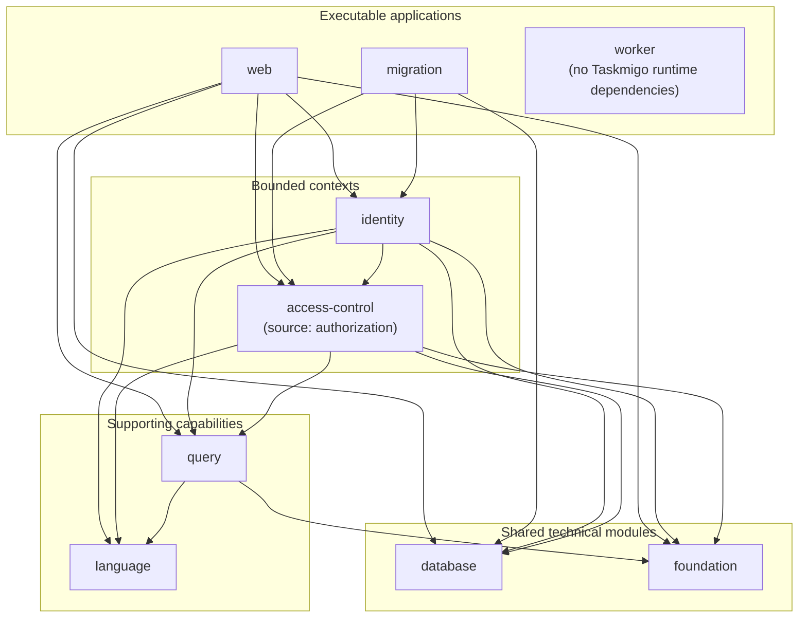
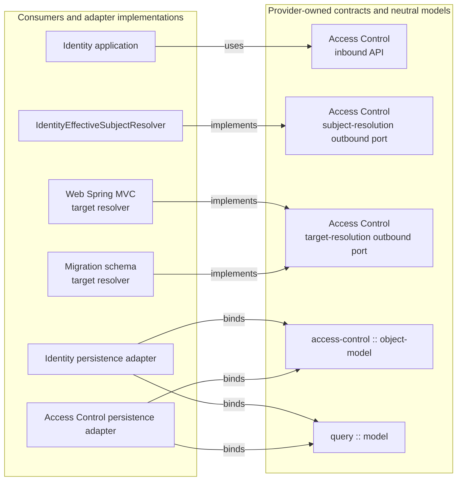

# 11. Appendices

## 11.1 Reference Context and Dependency Model

The following non-normative views mirror the current runtime project graph required by [Section 8.2](08-requirements-allocation-and-dependencies.md#82-allowed-dependency-model) and the integration boundaries defined by [Section 8.5](08-requirements-allocation-and-dependencies.md#85-context-integration-model).

### 11.1.1 Runtime project dependencies

A solid arrow points from a consumer project to the Taskmigo project it directly depends on.



The first view is intentionally project-level. It does not repeat the internal Onion/Hexagonal package flow described in [Section 2.4](02-overall-description.md#24-tactical-ddd-model).

### 11.1.2 Cross-context ports and neutral models

The second view isolates the relationships that are easiest to lose in the project graph. Each arrow points from the consumer or adapter implementation to the provider-owned contract or neutral model it depends on.



The logical project `:modules:access-control` is physically stored under `server/modules/authorization`, and its Java namespace remains `io.taskmigo.authorization`.

Project-level direction is intentionally coarser than package-level direction. Spring Modulith constrains published interfaces, while ArchUnit constrains domain/application/port/adapter dependencies inside projects.

The shared `:testing:architecture` project is test-only. It provides reusable ArchUnit rules through test dependencies and SHALL NOT become a production abstraction.

## 11.2 Context Map Example

The following conceptual model illustrates canonical ownership:

```text
Identity bounded context                   Access Control bounded context
────────────────────────                   ──────────────────────────────
User                                       Role
Group                                      Statement
Membership                                 RoleHierarchy
GroupHierarchy                             SubjectBinding
                                           AuthorizationDecision
        │                                           ▲
        └── implements subject-resolution outbound port ──┘
```

Identity MAY expose application use cases that accept Role or Statement identifiers for user-facing ergonomics. The underlying Access Control mutation SHALL occur through an Access-Control-owned published contract rather than by storing canonical authorization state inside an Identity aggregate.

## 11.3 Tactical Package Example

A bounded context MAY use the following layout when it matches the implementation's needs:

```text
io.taskmigo.authorization.role
├── domain
├── application
│   ├── port
│   │   ├── in
│   │   └── out
│   └── service
└── adapter
    └── out
        └── persistence
```

The exact package names are non-normative. The inbound/outbound port ownership and driving/driven dependency direction defined by [ARCH-CON-013](07-constraints.md#arch-con-013--tactical-layer-direction) are normative. Context-private inbound contracts MAY use an `application.port.in.internal` package and SHALL remain unpublished outside the bounded context. Executable driving adapters and composition roots remain outside the reusable bounded-context application core.

Reusable supporting capabilities MAY retain structures better matched to their semantics. For example, `language` MAY organize syntax, typing, compilation, Semantic AST, evaluation, and partial evaluation without inventing aggregate or repository abstractions.

## 11.4 Foundation Classification Examples

The following examples are supporting guidance for the [Architectural Boundary Test](02-overall-description.md#26-architectural-boundary-test):

| Candidate                                       | Classification                       | Reason                                                                                         |
| ----------------------------------------------- | ------------------------------------ | ---------------------------------------------------------------------------------------------- |
| Generic offset-pagination value                 | Foundation candidate.                | Its meaning is independent of a specific Taskmigo bounded context.                             |
| Common third-party utility used across modules  | Foundation candidate.                | It may be re-exported when intentionally established as part of the shared technical baseline. |
| Query Predicate                                 | `query`.                             | Its meaning is defined by Query Filtering semantics.                                           |
| Authorization Snapshot                          | `access-control`.                    | Its meaning is defined by Access Control authorization semantics.                              |
| Role                                            | `access-control`.                    | Role lifecycle, hierarchy, persistence, and policy aggregation are Access Control semantics.   |
| Language compiler                               | `language`.                          | Its meaning is defined by the Language supporting capability.                                  |
| User Query Schema                               | `identity`.                          | It is resource-specific query metadata for an Identity resource.                               |
| Spring MVC `FilteredQuery` resolver             | `web`.                               | It adapts Query Filtering to the web framework.                                                |
| Query expression/predicate model                | `query :: model`.                    | It is persistence-neutral and published for resource-owned binders.                            |
| Object Authorization expression/predicate model | `access-control :: object-model`.    | It is persistence-neutral and published for resource-owned binders.                            |
| JPA binder for a User Query Predicate           | Identity driven persistence adapter. | It translates an Identity-owned resource contract to Identity persistence topology.            |

## 11.5 Cross-Context Integration Examples

| Need                                                       | Expected integration                                                                                                    |
| ---------------------------------------------------------- | ----------------------------------------------------------------------------------------------------------------------- |
| Identity-facing use case assigns Roles to a User           | Identity application orchestration calls an Access-Control-owned subject-binding API with an opaque User subject id.    |
| Access Control requires a User's effective Group subjects  | Access Control invokes its owned subject-resolution outbound port; Identity supplies the driven adapter implementation. |
| Access Control validates HTTP Object Authorization targets | Access Control owns the target-resolution outbound port; Web implements it from Spring MVC route metadata.              |
| Migration validates managed Object Statements              | Access Control owns the target-resolution outbound port; Migration implements it from migration-known API routes.       |
| Audit/history reacts to a Role change                      | Access Control publishes a stable integration event consumed asynchronously by the history owner.                       |
| Identity displays Role details                             | Identity or web consumes an Access Control published query/API contract rather than reading Role tables.                |
| Resource persistence applies Object Authorization          | The resource-owning context translates the Access Control predicate into its own persistence query.                     |

## 11.6 Boundary Enforcement Examples

| Boundary condition                                                                                          | Expected enforcement                                                                                                  |
| ----------------------------------------------------------------------------------------------------------- | --------------------------------------------------------------------------------------------------------------------- |
| Dependency between [Spring Modulith](https://docs.spring.io/spring-modulith/reference/) application modules | Spring Modulith module model, explicit allowed dependencies, and `verify()`.                                          |
| Access to an additional published package of another application module                                     | Spring Modulith named interface plus an allowed dependency targeting that interface.                                  |
| Forbidden access to another application module's internal package                                           | Spring Modulith `verify()`.                                                                                           |
| Domain or application package depending on a concrete adapter/framework                                     | [ArchUnit](https://www.archunit.org/getting-started) Onion/Hexagonal dependency rule.                                 |
| Driving adapter depending on an application implementation or driven adapter                                | ArchUnit driving-adapter rule; the dependency is rejected.                                                            |
| Outbound port depending on its driven-adapter implementation                                                | ArchUnit outbound-port rule; the dependency is rejected.                                                              |
| Reusable library exporting Spring Boot/Data JPA without published API need                                  | Gradle exposure review; the dependency SHALL be moved to implementation scope.                                        |
| Distinct architectural packages sharing one physical module                                                 | Spring Modulith where representable, with ArchUnit rules for remaining intra-module restrictions.                     |
| Dependency between separate Taskmigo physical modules                                                       | Build dependency graph, plus Spring Modulith verification when the packages participate in the same executable model. |
| Cross-context access through another context's private persistence                                          | Architecture test plus repository/schema ownership review; the integration is rejected.                               |
